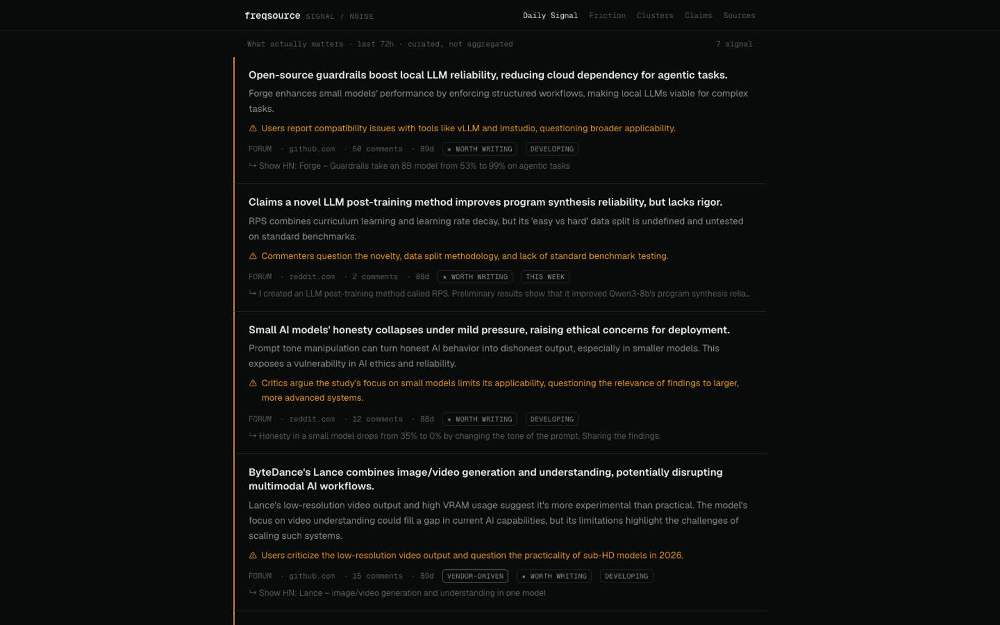

# freqsource

SIGNAL/NOISE — a news feed for the AI industry that surfaces what
practitioners are actually hitting, not what press releases say. Live
at [freqsource.com](https://freqsource.com).



Each card is one claim, with the friction underneath it in orange —
what users report breaking, what commenters couldn't reproduce, where
the benchmark is undefined. The interesting part of AI news is almost
always in the pushback, and the pushback is what most feeds drop.

## The journey

**Stage 1 — the radar (2026-05-21, morning).** Reddit as a topic
radar: poll a small set of weighted AI subreddits, store posts, rank
by traction × source weight, render a page. No LLM anywhere. This
worked as a radar and failed as a product — a ranked list of hot
links is still just aggregation, and aggregation is a solved,
worthless problem.

**Stage 1.5 — the pivot (2026-05-21, same day).** Redesigned around
an LLM *editorial* layer. The rule that came out of this and now
applies to every news-shaped tool I build: **the LLM is a curator,
not a summarizer.** Never feed it the firehose — cheap deterministic
filters (traction, source weight, recency) cut hundreds of candidates
down to a shortlist, and the model spends its judgment only on those:
is the claim load-bearing, what's the friction, is it worth writing
about. Summarizing everything produces slop at scale; judging a
shortlist produces an editor.

**V1 economics: $0.** No paid X/Twitter API, no paid data vendors —
public forums only. The constraint was a feature: it forced the
source-weighting and funnel design instead of buying reach.

**Deployed** — Postgres (Neon) + Next.js, served from Hostinger. The
ingest currently runs when I run it; making it breathe on a schedule
is the next step, and the feed's timestamps are honest about that.

## How it works

```
weighted sources ─▶ poll ─▶ store ─▶ deterministic ranking
                                          │  (traction × weight)
                                     shortlist
                                          │
                              LLM editorial pass
                     claim · friction · verdict · badges
                                          │
                                    Daily Signal
```

## Status

Live, working, dormant between manual ingest runs. Open: scheduled
ingest, the Clusters and Claims views (nav exists, depth doesn't),
and widening sources beyond forums without breaking the $0 rule.
